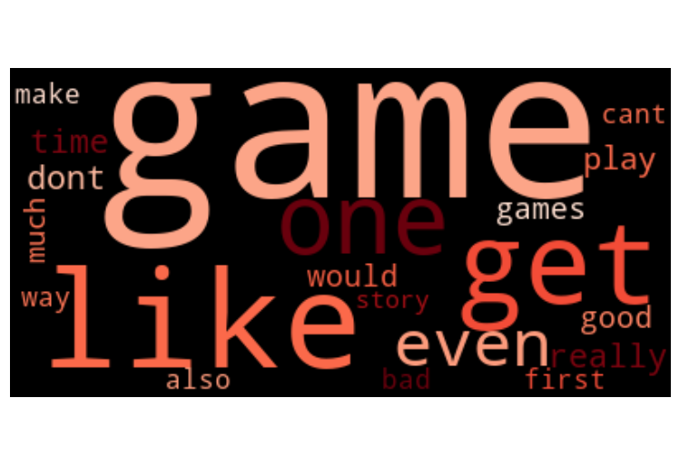

# Video Game Review Analysis

Andrew Muller

## Business Case

This goal of this project is to create a model that can predict sentiment of internet talk about video games. Specifically, it will be a neural network model trained on Steam reviews. The reviews are marked either "suggested" or "not suggested", coresponding to a results classification of "positive" or "negative". Eventually, the project will result in a website that, when supplied with a Twitter hashtag or Reddit thread, will analyze the sentiment of the related comments.

## Data Collection

The data is user reviews collected from Steam. Steam user reviews are available for any Steam user to write. They are labeles are either "suggested" or "not suggested" (referring to the game they are about), and can be voted as "helpful" or "unhelpful" by other Steam users. Notebook 1 reads the id's for the top 750 most popular games on Steam, and gets the 100 most helpful reviews from each. The helpful reviews are chosen because they are more likely to contain meaningful text in English characters that can be interpereted by the models. The end result is 73,096 reviews, as some of the games have less than 100 reviews.

## Data Processing

Instead of csv files, the data is stored in the feather format, to decrease their size, as the dataset is large. To preprocess the data, markdown tags and punctuation marks are removed, and the remaining text is tokenized using nltk's regexp tokenizer, capturing only lating characters and arabic numerals. The tokens are then lemmatized using nltk's wordnet lemmatizer. To engineer the features to model the data on, scikit-learn's tf-idf vectorizer is used, both with and without bigrams, to generate 8000 features for each datapoint. Additionally, gensim's doc2vec transformer is used to create another 100-feature vector set for each review.

## Exploratory Data Analysis

The training dataset has 223,823 unique tokens, although most of these will be meaningless in terms of classification.

Many of the most common words are used in both classes. Words like "game" and "play" make sense, but even "like" has similar representation across the two classes. The frequency distribution charts and wordclouds below show this well.

## Base Models

Logistic regression, random forest, and multinomial naive bayes models were trained on the training data. The accuracy of predictions on the testing data is used to determine the success of the models. I also performed a grid search on the logistic regression and random forest models. I tested them using the tf-idf with bigrams data, as that performed the best on a sample dataset I had tested this process on.

insert results table here

## Neural Networks

I created a basic convoluted neural network using dense and dropout layers. A gridsearch was performed, but the search could not be very wide, as the models take so long to train. The final model is very close to the first one made, and had a test accuracy of 91%, matching that of the logistic regression model. Although it didn't perform any better on the test set, I'm hoping it will generalize more to reviews and comments from sources other than Steam.

I also made a recurrent neural network using other layer types, namely embedding and LSTM layers. Even after a grid search, It performed worse than the cnn, with only 89% test accuracy. I believe I don't have a good enough idea yet on what range of hyperparameter values would work best, or what layeres to include, but I do think this type of model has the potential to eventually outperform the earlier network.

## Flask

To get unalabed internet data to perform analysis on, I used twint for Twitter searches and praw to read Reddit threads. After loading in the model saved using pickle, predictions are run on the scraped data. The script then prints out the percentages of comments that are positive and negative, and samples five random from each category.

To run this flask app, simply copy the contents of the flask-files folder to the main directory, then run app.py

## Conclusions and Future Work

My product for this project can currently only live locally. The neural network models are too large to live on the free tier of the heroku server, and even with the smaller sklearn models, the data pulled in to process pushes the server over its 500 MB limit and crashes. In order to make it work (for free), I need to upload a model and a data cleaning pipeline to Amazon's S3, and access that from the heroku app.

As well, all the models overpredict on the majority class, positive. This could be mitigated by normal class impalance techniques, such as SMOTE and Tomek links. Unfortunately, the large data size needed to make generalizations makes it impossible to trial oversampling on my current machine. In order to run these processes, I need to run them on a stronger machine, or more likely, an Amazon Sagemaker instance.

To improve the usefulness of the models, I also need to incorporate some method of topic modelling. Topic modelling could push the results of the model from interesting to useful. I hope to use a tf-idf topic analysis in the final product, which would show what things each of the two classes are discussing the most.

Finally, the models may, after all that, still have trouble generalizing. The training data is taken only from Steam, while the unlabaled actual data is taken from other sites, Twitter and Reddit. To improve on this issue, I could gather training data from other sources. Metacritic seems like a good choice, as the reviews on there are scored, which could easily be turned into labels. Getting Steam reviews from a wider variety of games could also help.
